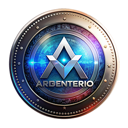

# 🇦🇹 Argenterío - Hotels Austria (ACTUALIZADO)

## ✅ Cambios Realizados

**Versión:** landing_hotels_austria_**v2**.html  
**Logo:** Argenterío (Cilo logo - confirmar si es correcto)  
**Subdomain:** `store.argenterio.com`

---

## 📞 Contacto Configurado

### WhatsApp ✅
- **Número:** `+54 9 11 7371-9972` 
- **Link:** `https://wa.me/5491173719972`

### Email ✅
- **Dirección:** `agentes.space@gmail.com`
- **Asunto:** Demo-Anfrage Hotel (DE), Hotel Demo Request (EN), Solicitud Demo Hotel (ES)

### LinkedIn
- **Estado:** NO configurado aún
- **Recomendación:** Agregar como tercer canal para contactos de embajada

---

## 📁 Archivos Listos para Deploy

```
austria/
├── index.html          ← v2 con glassmorphism + animaciones
├── logo.png           ← Logo Argenterío (verificar si es correcto)
├── README.md          ← Guía de deployment
└── assets/
    ├── swiss-village-beautiful-mountains-austria.jpg
    └── flag-austria-with-ensign.jpg
```

---

## ⚠️ IMPORTANTE: Verificar Logo

El logo actual (`logo.png`) muestra "Cilo" que parece ser de otro proyecto.

**Opciones:**
1. **Usar texto solo:** Remover `` y dejar solo "Argenterío" 
2. **Crear logo nuevo:** Usar herramienta de diseño para logo Argenterío
3. **Confirmar:** Si el logo Cilo es intencional (reutilizado)

**Para remover logo y usar solo texto:**
Editar línea 739-742 en `index.html`:
```html
<!-- ANTES: -->
<div class="logo" style="display: flex; align-items: center; gap: 12px;">
    
    Argenterío
</div>

<!-- DESPUÉS: -->
<div class="logo">Argenterío</div>
```

---

## 🎨 Diferencias v2 vs v1

**V2 incluye:**
- ✅ Glassmorphism effects
- ✅ Animated gradient background
- ✅ Micro-interactions en hover
- ✅ Diseño más moderno y premium
- ✅ Mejor responsive design

**V1 era:**
- Diseño más tradicional
- Sin animaciones
- Fondo estático

---

## 🚀 Deploy Checklist

- [x] HTML v2 copiado a `/austria/index.html`
- [x] WhatsApp actualizado: `5491173719972`
- [x] Email actualizado: `agentes.space@gmail.com`
- [x] Branding: "Argenterío" con tilde
- [x] Assets path corregido: `./assets/`
- [ ] **PENDIENTE:** Verificar/actualizar logo
- [ ] **PENDIENTE:** Agregar LinkedIn (opcional)
- [ ] Probar localmente
- [ ] Subir a `store.argenterio.com`

---

## 🏛️ Next Steps: Embajada

1. Deploy del sitio a `store.argenterio.com`
2. Enviar mensaje LinkedIn a contactos (ver `ESTRATEGIA_EMBAJADA_AUSTRIA.md`)
3. Testear todos los botones de contacto
4. Decidir si agregar LinkedIn como tercer canal

---

**Última actualización:** 2026-02-06  
**Status:** ✅ Listo para deploy (pendiente verificación logo)
